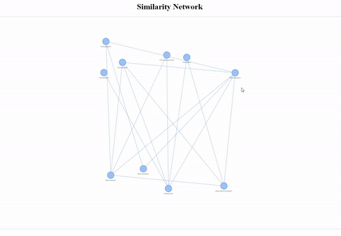

# Interactive Similarity Network using python

Script developed to build an interactive molecular similarity network to visualize Tanimoto similarity between molecules in a dataset. 



## Libraries used

* [pandas](https://pandas.pydata.org/) - a Python package that provides fast, flexible, and expressive data structures designed to make working with "relational" or "labeled" data both easy and intuitive. 

* [NumPy](https://numpy.org/) -  the fundamental package for array computing with Python

* [RDKit](https://www.rdkit.org/) - Open source toolkit for cheminformatics

* [NetworkX](https://networkx.org/) - a Python package for the creation, manipulation, and study of the structure, dynamics, and functions of complex networks.

* [Matplotlib](https://matplotlib.org/) - a comprehensive library for creating static, animated, and interactive visualizations in Python.

* [pyvis](https://pyvis.readthedocs.io/en/latest/) - Interactive network visualizations.

Libraries were used in a [Miniconda3](https://docs.conda.io/en/latest/miniconda.html) environment using python 3.6.13 

## Instalation

Miniconda3: [Installation](https://conda.io/projects/conda/en/latest/user-guide/install/index.html)

pandas:
```
conda install -c anaconda pandas
```
numpy
```
conda install -c anaconda numpy
```
RDKit
```
conda install -c rdkit rdkit
```
NetworkX
```
conda install -c anaconda networkx
```
Matplotlib
```
conda install -c conda-forge matplotlib
```
pyvis
```
conda install -c conda-forge pyvis
```

## How to run

Download the code and unzip it on the desirable directory

To run use the following command:
```
python similarityNetwork.py
```

* The dataset layout should be in the format 'smiles' 'molecule_name' as presented in the [dataset_ds.smi](resources/dataset_ds.smi)

* The threshold may be changed in line 40 as it follows
```
Tc = DataStructs.TanimotoSimilarity(fps[i], fps[j])
        **if Tc >= 0.3:**
            g.add_edge(smiles[i], smiles[j], length=1000)
```  

## Observations

**This script has been elaborated using as references the following articles and codes:**

* [Draw molecular network on Jupyter notebook with rdkit and cytoscape.js](https://iwatobipen.wordpress.com/2019/03/19/draw-molecular-network-on-jupyter-notebook-with-rdkit-and-cytoscape-js-rdkit-cytoscape/) - [code](https://nbviewer.jupyter.org/github/iwatobipen/playground/blob/master/cytoscapejs_py.ipynb)

* [Molecular similarity network with visualised structures](https://yossadh.github.io/posts/2019/03/molecular-similarity-network/) - [code](https://github.com/yossadh/yossadh.github.io/blob/master/files/molecular_similarity_network.ipynb)


## Authorship

* Author: **Brenda Ferrari** ([brendaferrari](https://github.com/brendaferrari))
* Co-author: **Camilo Lima** ([limacamilo](https://github.com/limacamilo))

Social preview original photo by **Brenda Ferrari** ([brendaferrari](https://github.com/brendaferrari))